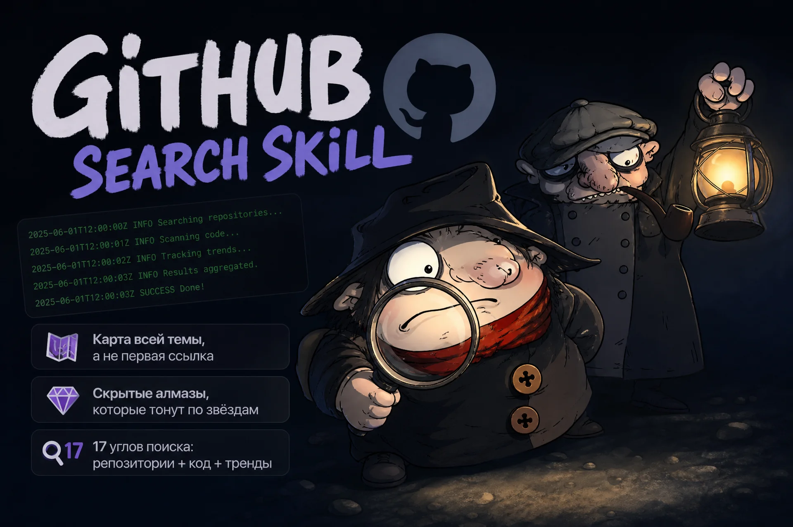

# github-search

[](https://docs.claude.com/en/docs/claude-code)
[](https://github.com/bdmitrypix23-ui/github-search-skill/releases)
[](LICENSE)
[](https://github.com/bdmitrypix23-ui/github-search-skill/stargazers)

A [Claude Code](https://docs.claude.com/en/docs/claude-code) skill for **exhaustive GitHub search** — find ready-made projects, libraries, tools, MCP servers, and see how others implement a function in real code.

Ordinary search returns the first popular link, so you miss the better tool just because it has fewer stars. This skill surfaces fresher, more capable repos that star-ranking buries — for example, a **19★ MCP server with more tools than the 5800★ leader**. You get the whole map of a topic, not just its top result.

## What you get

- **Nothing slips through** — one engine misses what the others find, so the skill runs **17 search angles** across `gh search`, REST `search/*`, and GraphQL instead of trusting one.
- **No wasted tries** — a hard-won **dead-ends table** of what does NOT work in GitHub search (long phrases, `OR` in `gh search repos`, `symbol:` in code search…), so you skip the dozens of empty queries.
- **See how it's actually built** — code search (`references/code-search.md`) for "how do people implement X" (rate-limit retry, webhook parsing, building an MCP tool), not just "find a project".
- **Sweep a whole topic at once** — `assets/gh_hunt.sh` runs 50–100 searches with rate-limit handling, dedup, and clean JSON output. Edit the arrays, run it in the background.
- **Find existing skills** — locate other Claude skills via GitHub Code Search and public registries before you build your own.

## Install

```bash
git clone https://github.com/bdmitrypix23-ui/github-search-skill.git ~/.claude/skills/github-search
```

Or copy the repo contents into `~/.claude/skills/github-search/` (needs `SKILL.md`, `references/`, `assets/`).

## Requirements

- [GitHub CLI](https://cli.github.com/) (`gh`), authenticated: `gh auth login`
- `jq` (for `gh_hunt.sh` and JSON parsing): `brew install jq`

The `gh_hunt.sh` script targets macOS (BSD grep, no `-P`) but also runs on Linux.

## Note

The skill prompt (`SKILL.md`) is written in Russian. The techniques themselves are language-agnostic — the `gh` commands and the dead-ends table work regardless of prompt language.

## How it works

No scraping, no third-party services — just the **official GitHub API** (`gh` CLI, REST, GraphQL).

```
2025-06-01T12:00:00Z INFO    Searching repositories...
2025-06-01T12:00:01Z INFO    Scanning code...
2025-06-01T12:00:02Z INFO    Tracking trends...
2025-06-01T12:00:03Z INFO    Results aggregated.
2025-06-01T12:00:03Z SUCCESS Done!
```

That's the whole skill.

## License

MIT — see [LICENSE](LICENSE).
